# Diagramas de Arquitectura — PrinterServices + QuipuNet (Mermaid)

> Generado: 2026-03-13

---

## 1. Diagrama de Arquitectura de Aplicación — PrinterServices con QuipuNet (Modo Cliente y Servidor)

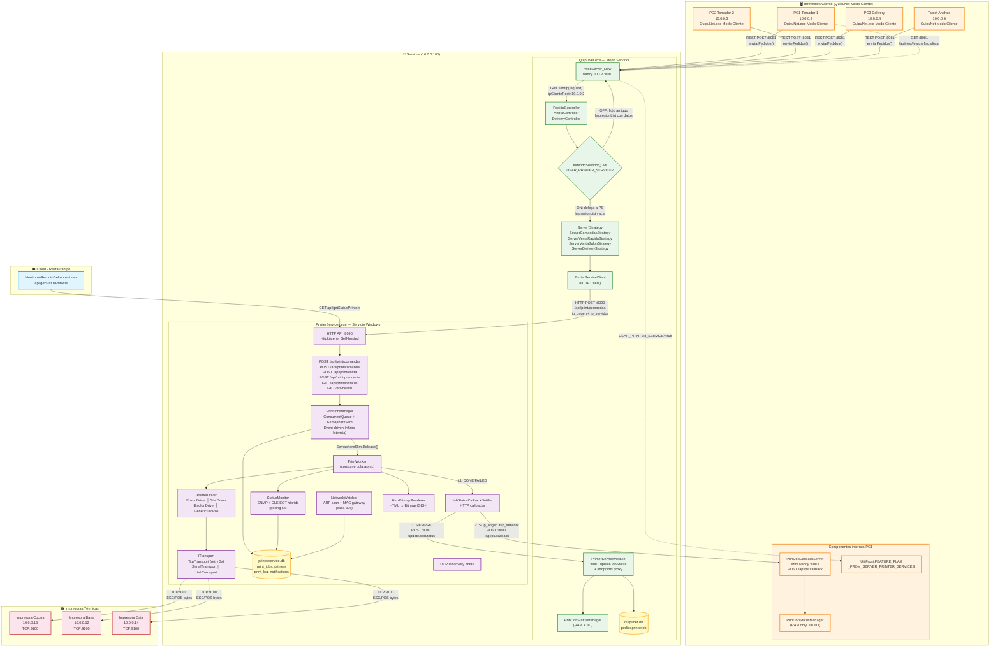

---

## 2. Diagrama de Flujo de Comunicación — Modo Servidor vs Modo Cliente

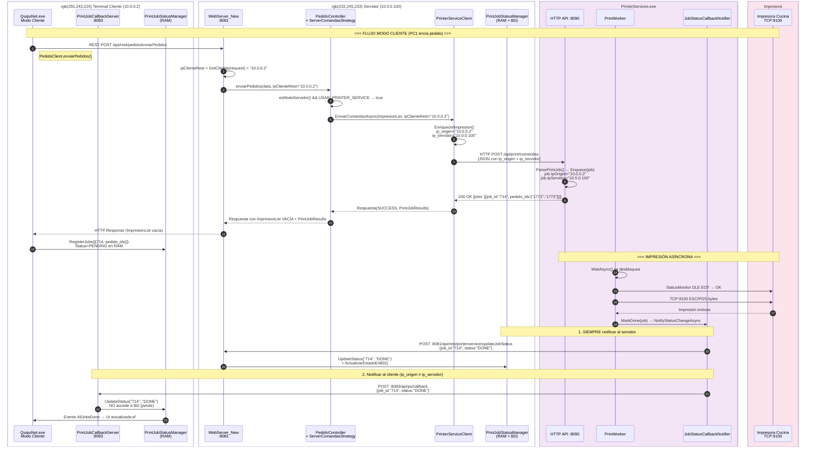

---

## 3. Diagrama de Flujo — Modo Servidor Directo (sin cliente REST)

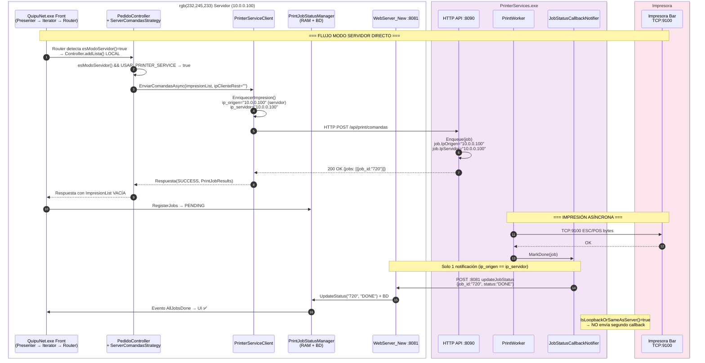

---

## 4. Diagrama de Eventos Visuales (UI) — Modo Servidor

```mermaid
stateDiagram-v2
    direction TB

    state "QuipuNet Modo SERVIDOR" as SERVER {

        state "Presenter (Front)" as PRES_S {
            [*] --> EnviaPedido_S: Usuario confirma pedido
            EnviaPedido_S --> VerificaFlag_S: Respuesta del Backend

            state VerificaFlag_S <<choice>>
            VerificaFlag_S --> FlujoAntiguo_S: FLAG OFF<br/>ImpresionList con datos
            VerificaFlag_S --> FlujoPrinterService_S: FLAG ON<br/>ImpresionList vacía

            state "Flujo Antiguo (local)" as FlujoAntiguo_S {
                ImprimirLocal_S: ImpresionService.ImprimirAsync()
                ImprimirLocal_S --> PrintUtil_S: PrintUtil.imprimirComandasEthernet()
                PrintUtil_S --> TCP_S: ESCPOSPrinterEthernet → TCP:9100
            }

            state "Flujo PrinterServices" as FlujoPrinterService_S {
                DetectaPJR_S: Detecta PrintJobResults en Respuesta.Data
                DetectaPJR_S --> RegisterJobs_S: PrintJobStatusManager.RegisterJobs()
                RegisterJobs_S --> ShowModal_S: showImprimiendoPrinterService()
            }
        }

        state "Modal de Progreso (PSProgressService)" as MODAL_S {
            [*] --> Enviando0_S: "Enviando 0 de N documento(s)"
            Enviando0_S --> EnviandoX_S: Callback DONE llega<br/>CantidadCompletados++

            state EnviandoX_S <<choice>>
            EnviandoX_S --> BarraAzul_S: Parcial<br/>"Enviando X de N"
            EnviandoX_S --> BarraVerde_S: Todos OK<br/>"Enviando N de N"
            EnviandoX_S --> BarraRoja_S: Alguno FAILED/EXPIRED

            BarraAzul_S --> EnviandoX_S: Siguiente callback
            BarraVerde_S --> CierraExito_S: Auto-cierra modal
            BarraRoja_S --> ModalError_S: showFailedPrinterService()
        }

        state "Modal Error" as ModalError_S {
            MuestraFallos_S: Muestra jobs FAILED/EXPIRED
            MuestraFallos_S --> Reintentar_S: Usuario presiona Reintentar
            MuestraFallos_S --> Cerrar_S: Usuario cierra
            Reintentar_S --> MODAL_S: POST /api/job/{id}/retry
        }

        state "Cabecera (UtilesCabeceraViewModel)" as CAB_S {
            [*] --> ConfigVisibilidad_S: ConfigurarVisibilidadGestionImpresiones()
            ConfigVisibilidad_S --> BtnVisible_S: FLAG ON → Botón gestión visible
            ConfigVisibilidad_S --> BtnOculto_S: FLAG OFF → Botón oculto

            BtnVisible_S --> SubscribeQueue_S: SubscribeToQueueEvents()
            SubscribeQueue_S --> EscuchaEventos_S: PrintJobStatusManager eventos

            state "Eventos de Estado" as EscuchaEventos_S {
                JobStatusChanged_S: JobStatusChanged
                AllJobsDone_S: AllJobsDone
                SomeJobsFailed_S: SomeJobsFailed
            }

            JobStatusChanged_S --> BadgeUpdate_S: Actualizar badge
            SomeJobsFailed_S --> BadgeRojo_S: Badge "Impr. Fallida" ❌
            AllJobsDone_S --> BadgeVerde_S: Badge desaparece ✅
        }

        state "Callbacks desde PrinterServices" as CB_S {
            [*] --> RecibeCallback_S: POST :8081 updateJobStatus
            RecibeCallback_S --> PSModule_S: PrinterServiceModule procesa
            PSModule_S --> UpdateBD_S: ActualizarEstadoEnBD()
            PSModule_S --> UpdateRAM_S: PrintJobStatusManager.UpdateStatus()
            UpdateRAM_S --> EventoUI_S: Dispara eventos → UI se actualiza
        }
    }
```

---

## 5. Diagrama de Eventos Visuales (UI) — Modo Cliente

```mermaid
stateDiagram-v2
    direction TB

    state "QuipuNet Modo CLIENTE" as CLIENT {

        state "Inicialización (MenuPrincipalview)" as INIT_C {
            [*] --> WindowLoaded_C: Window_Loaded (async)
            WindowLoaded_C --> CheckFlag_C: checkearSiServidorTienePrinterServicesActivo()
            CheckFlag_C --> FetchFlag_C: GET :8081/api/rest/featureflags/listar
            FetchFlag_C --> SetFlag_C: UtilFront.FEATURE_FLAG = true/false

            state SetFlag_C <<choice>>
            SetFlag_C --> InitClient_C: FLAG=true → InitClientMode()
            SetFlag_C --> NoInit_C: FLAG=false → No hace nada

            InitClient_C --> StartMiniNancy_C: PrintJobCallbackServer.Start() :8083
            StartMiniNancy_C --> Ready_C: Listo para recibir callbacks
        }

        state "Presenter (Front)" as PRES_C {
            [*] --> EnviaPedido_C: Usuario confirma pedido
            EnviaPedido_C --> RESTServidor_C: PedidoClient.enviarPedidos()<br/>REST POST :8081

            RESTServidor_C --> RespuestaServidor_C: Servidor procesa + responde

            state VerificaFlag_C <<choice>>
            RespuestaServidor_C --> VerificaFlag_C

            VerificaFlag_C --> FlujoAntiguo_C: ImpresionList CON datos<br/>(servidor FLAG OFF)
            VerificaFlag_C --> FlujoPSCliente_C: ImpresionList VACÍA +<br/>esModoCliente() && FLAG_FROM_SERVER

            state "Flujo Antiguo (local)" as FlujoAntiguo_C {
                ImprimirLocal_C: Imprime localmente<br/>PrintUtil → TCP:9100
            }

            state "Flujo PrinterServices (delegado)" as FlujoPSCliente_C {
                DetectaPJR_C: Detecta PrintJobResults
                DetectaPJR_C --> RegisterJobs_C: PrintJobStatusManager.RegisterJobs()
                RegisterJobs_C --> ShowModal_C: showImprimiendoPrinterService()
            }
        }

        state "Modal de Progreso (idéntico al servidor)" as MODAL_C {
            [*] --> Enviando0_C: "Enviando 0 de N documento(s)"
            Enviando0_C --> EnviandoX_C: Callback DONE vía :8083

            state EnviandoX_C <<choice>>
            EnviandoX_C --> BarraAzul_C: Parcial
            EnviandoX_C --> BarraVerde_C: Todos OK
            EnviandoX_C --> BarraRoja_C: Alguno FAILED

            BarraAzul_C --> EnviandoX_C: Siguiente callback
            BarraVerde_C --> CierraExito_C: ✅ Éxito
            BarraRoja_C --> ModalError_C: ❌ Error
        }

        state "Callbacks desde PrinterServices" as CB_C {
            [*] --> RecibeCallback_C: POST :8083 /api/ps/callback
            RecibeCallback_C --> MiniNancy_C: PrintJobCallbackModule procesa
            MiniNancy_C --> UpdateRAM_C: PrintJobStatusManager.UpdateStatus()
            Note_C: ⚠️ JAMÁS accede a BD
            UpdateRAM_C --> EventoUI_C: Dispara eventos → UI se actualiza
        }

        state "Consulta Históricos (REST al servidor)" as HIST_C {
            [*] --> NecesitaHist_C: Entrar a mesa / ver estado
            NecesitaHist_C --> RESTProxy_C: PrintJobStatusClient.getFailedPedidoIds()
            RESTProxy_C --> ServidorProxy_C: GET :8081/api/rest/printerservice/jobs/failed-pedidos
            ServidorProxy_C --> RespProxy_C: Servidor consulta BD → responde
            RespProxy_C --> MarkBadge_C: p.IsPrinterComandaFailed = true<br/>→ Badge rojo visible
        }

        state "Cabecera (UtilesCabeceraViewModel)" as CAB_C {
            [*] --> ConfigVis_C: ConfigurarVisibilidadGestionImpresiones()

            state ConfigCheck_C <<choice>>
            ConfigVis_C --> ConfigCheck_C
            ConfigCheck_C --> BtnVisible_C: FeatureFlag local ON<br/>|| (esModoCliente() && FLAG_FROM_SERVER)
            ConfigCheck_C --> BtnOculto_C: Ambos OFF

            BtnVisible_C --> SubscribeQ_C: SubscribeToQueueEvents()
            SubscribeQ_C --> Eventos_C: PrintJobStatusManager eventos

            state "Eventos de Estado" as Eventos_C {
                JSC_C: JobStatusChanged
                AJD_C: AllJobsDone
                SJF_C: SomeJobsFailed
            }

            JSC_C --> BadgeUpd_C: Actualizar badge
            SJF_C --> BadgeR_C: Badge rojo ❌
            AJD_C --> BadgeG_C: Badge desaparece ✅
        }

        state "Cierre de sesión" as CLOSE_C {
            [*] --> WindowClosed_C: Window_Closed
            WindowClosed_C --> StopClient_C: PrintJobStatusManager.StopClientMode()
            StopClient_C --> StopNancy_C: PrintJobCallbackServer.Stop()
            StopNancy_C --> FreePort_C: Libera puerto :8083
        }
    }
```

---

## 6. Diagrama Comparativo — Puertos y Protocolos (Servidor vs Cliente)

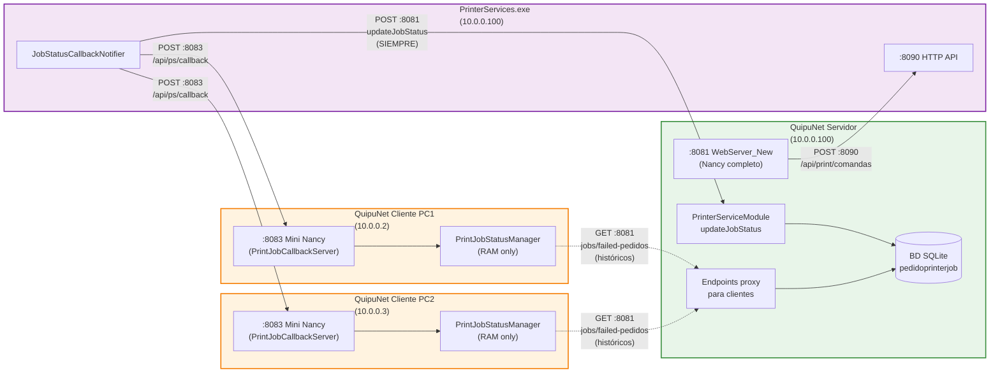

---

## 7. Diagrama Detallado — Modal Progresivo en Modo Cliente

### 7.1 Flujo completo: Desde el pedido hasta el cierre del modal

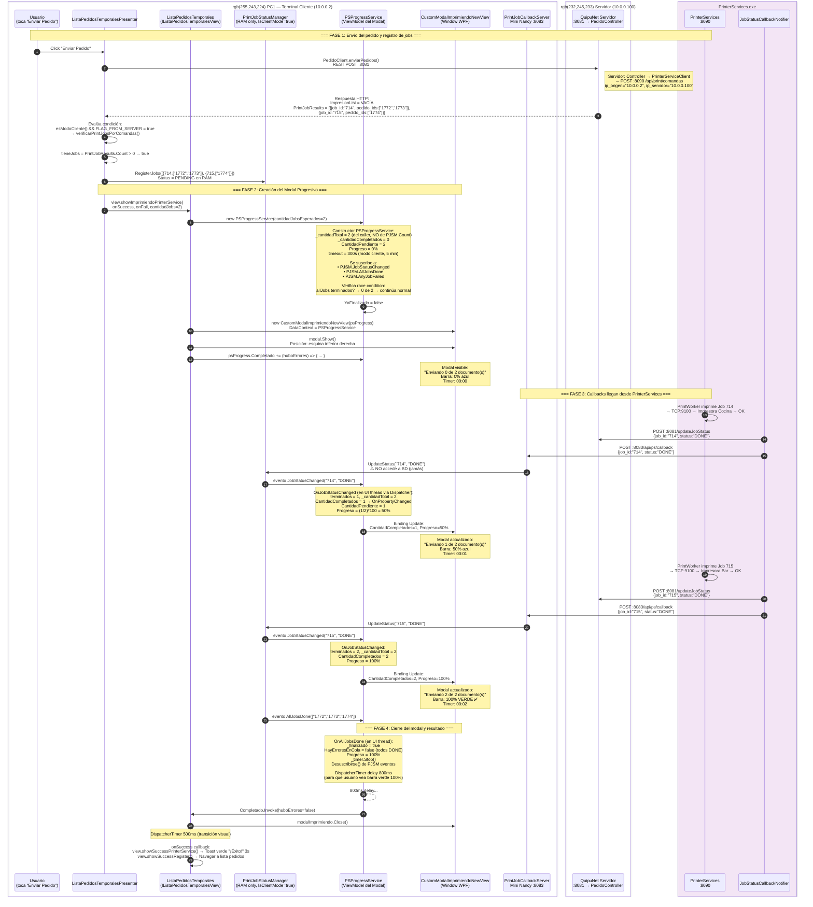

### 7.2 Flujo con error: Un job falla en modo cliente

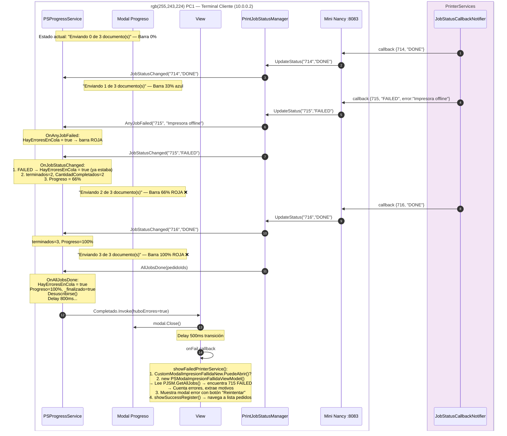

### 7.3 Diagrama de clases y bindings del modal progresivo

```mermaid
classDiagram
    class PSProgressService {
        <<ViewModel - INotifyPropertyChanged>>
        -DispatcherTimer _timer
        -DateTime _inicio
        -double _progreso
        -int _cantidadTotal
        -int _cantidadCompletados
        -int _cantidadPendiente
        -bool _hayErroresEnCola
        -bool _finalizado
        -bool _yaFinalizadoConErrores
        +string FechaInicio
        +string HoraInicio
        +int CantidadTotal
        +int CantidadCompletados
        +int CantidadPendiente
        +double Progreso
        +string TiempoTranscurrido
        +bool HayErroresEnCola
        +bool YaFinalizado
        +bool YaFinalizadoConErrores
        +event Completado(bool huboErrores)
        +PSProgressService(cantidadJobsEsperados, ownerWindow)
        +Detener()
        -OnJobStatusChanged(jobId, status)
        -OnAllJobsDone(pedidoIds)
        -OnAnyJobFailed(jobId, error)
        -Timer_Tick()
        -Desuscribirse()
    }

    class CustomModalImprimiendoNewView {
        <<Window WPF>>
        -ProgressService _progressService
        +CustomModalImprimiendoNewView()
        +CustomModalImprimiendoNewView(externalDataContext)
    }

    class PrintJobStatusManager {
        <<Singleton - RAM only en cliente>>
        -PrintJobCallbackServer _callbackServer
        -bool _isClientMode
        +bool IsClientMode
        +int Count
        +RegisterJobs(jobs)
        +UpdateStatus(jobId, status)
        +GetAllJobs() List~PrintJobInfo~
        +GetPendingCount() int
        +InitClientMode()
        +StopClientMode()
        +event JobStatusChanged(jobId, status)
        +event AllJobsDone(pedidoIds)
        +event AnyJobFailed(jobId, error)
    }

    class PrintJobCallbackServer {
        <<Mini Nancy :8083>>
        +int CALLBACK_PORT = 8083
        -NancyHost _host
        +bool IsRunning
        +Start()
        +Stop()
        +Dispose()
    }

    class PrintJobCallbackModule {
        <<NancyModule /api/ps>>
        +POST /callback
        -ProcessCallback()
    }

    class CallbackOnlyBootstrapper {
        <<NancyBootstrapper>>
        -BeforeRequest pipeline
        +Solo permite POST /api/ps/callback
        +Todo lo demás → 404
    }

    class ListaPedidosTemporales {
        <<View - IListaPedidosTemporalesView>>
        +showImprimiendoPrinterService(onSuccess, onFail, cantidadJobs)
        +showFailedPrinterService()
        +showSuccessPrinterService()
        +showSuccessRegister()
    }

    class ListaPedidosTemporalesPresenter {
        <<Presenter>>
        -verificarPrintJobsPorComandas(respuesta, view)
        +enviarPedidos()
    }

    PSProgressService --> PrintJobStatusManager : se suscribe a eventos
    CustomModalImprimiendoNewView --> PSProgressService : DataContext (MVVM Binding)
    PrintJobCallbackServer --> PrintJobCallbackModule : hospeda
    PrintJobCallbackServer --> CallbackOnlyBootstrapper : usa
    PrintJobCallbackModule --> PrintJobStatusManager : UpdateStatus()
    PrintJobStatusManager --> PrintJobCallbackServer : _callbackServer
    ListaPedidosTemporales --> PSProgressService : crea instancia
    ListaPedidosTemporales --> CustomModalImprimiendoNewView : crea y muestra
    ListaPedidosTemporalesPresenter --> ListaPedidosTemporales : view.showImprimiendoPrinterService()
```

### 7.4 Bindings XAML del modal

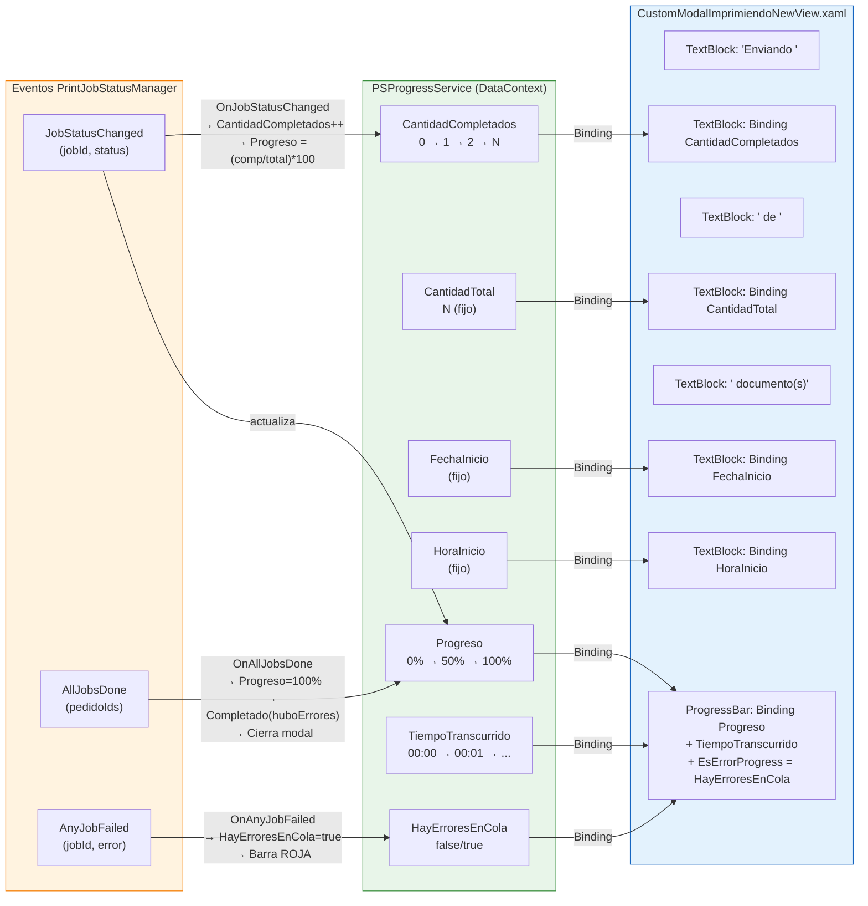

### 7.5 Ciclo de vida completo del modal — Estados y transiciones

```mermaid
stateDiagram-v2
    direction TB

    state "Modal Progresivo — Modo Cliente" as MODAL_CLIENT {

        state "INICIALIZACIÓN" as INIT {
            [*] --> CrearPSProgress: Presenter llama view.showImprimiendoPrinterService(onSuccess, onFail, cantidadJobs)
            CrearPSProgress --> SetCantidad: _cantidadTotal = cantidadJobsEsperados (del caller)
            SetCantidad --> VerificarRace: Verificar si jobs ya terminaron (race condition PS <5ms)

            state VerificarRace <<choice>>
            VerificarRace --> YaTermino: terminados >= _cantidadTotal
            VerificarRace --> ContinuaNormal: terminados < _cantidadTotal

            YaTermino --> SkipModal: YaFinalizado=true → NO mostrar modal

            state SkipModal <<choice>>
            SkipModal --> DirectoSuccess: Sin errores → onSuccess()
            SkipModal --> DirectoFail: Con errores → onFail()

            ContinuaNormal --> Suscribirse: Suscribirse a PJSM eventos
            Suscribirse --> IniciarTimer: DispatcherTimer 500ms
            IniciarTimer --> CrearModal: new CustomModalImprimiendoNewView(psProgress)
            CrearModal --> MostrarModal: modal.Show() esquina inferior derecha
        }

        state "MODAL VISIBLE — Esperando callbacks" as VISIBLE {
            [*] --> Enviando0: "Enviando 0 de N documento(s)"
            Enviando0 --> EsperaCallback: Barra 0% azul — Timer 00:00

            state "Recibe Callback vía Mini Nancy :8083" as EsperaCallback {
                [*] --> CallbackLlega: POST /api/ps/callback
                CallbackLlega --> PJSM_Update: PJSM.UpdateStatus(jobId, status)
                PJSM_Update --> DisparaEvento: Dispara JobStatusChanged / AnyJobFailed
            }

            EsperaCallback --> EvaluaStatus: OnJobStatusChanged en UI thread

            state EvaluaStatus <<choice>>
            EvaluaStatus --> StatusDONE: status == "DONE"
            EvaluaStatus --> StatusFAILED: status == "FAILED" o "EXPIRED"

            StatusDONE --> ActualizaProgreso: CantidadCompletados++<br/>Progreso = (comp/total)*100
            StatusFAILED --> MarcarError: HayErroresEnCola = true<br/>→ Barra cambia a ROJA
            MarcarError --> ActualizaProgreso

            ActualizaProgreso --> VerificaTodos: ¿terminados >= _cantidadTotal?

            state VerificaTodos <<choice>>
            VerificaTodos --> EsperaCallback: Faltan más callbacks
            VerificaTodos --> TodosTerminaron: AllJobsDone disparado
        }

        state "TIMEOUT de seguridad" as TIMEOUT {
            [*] --> CheckTimeout: Timer_Tick cada 500ms
            CheckTimeout --> TimeoutAlcanzado: tiempo >= 300s (5 min en cliente)
            TimeoutAlcanzado --> ForzarCierre: _finalizado=true<br/>HayErroresEnCola=true<br/>Progreso=100% (barra roja)<br/>Completado(huboErrores=true)
        }

        state "FINALIZACIÓN" as FIN {
            TodosTerminaron --> SetFinalizado: _finalizado = true
            SetFinalizado --> CalculaErrores: Recorre allJobs → ¿alguno FAILED/EXPIRED?
            CalculaErrores --> SetProgreso100: Progreso = 100%
            SetProgreso100 --> StopTimer: _timer.Stop()
            StopTimer --> Desuscribir: Desuscribirse de PJSM eventos
            Desuscribir --> Delay800ms: DispatcherTimer 800ms<br/>(usuario ve barra verde/roja al 100%)

            state EvalResultado <<choice>>
            Delay800ms --> EvalResultado
            EvalResultado --> CompletadoOK: HayErroresEnCola=false
            EvalResultado --> CompletadoError: HayErroresEnCola=true

            CompletadoOK --> InvokeSuccess: Completado.Invoke(false)
            CompletadoError --> InvokeFail: Completado.Invoke(true)
        }

        state "CIERRE DEL MODAL" as CIERRE {
            InvokeSuccess --> CerrarModal: modalImprimiendo.Close()
            InvokeFail --> CerrarModal
            ForzarCierre --> CerrarModal
            CerrarModal --> Delay500ms: DispatcherTimer 500ms transición visual

            state ResultadoFinal <<choice>>
            Delay500ms --> ResultadoFinal

            ResultadoFinal --> OnSuccess: huboErrores=false
            ResultadoFinal --> OnFail: huboErrores=true

            OnSuccess --> ToastVerde: showSuccessPrinterService()<br/>Toast "¡Éxito!" 3s
            ToastVerde --> Navegar: showSuccessRegister()

            OnFail --> ModalFallida: showFailedPrinterService()
            ModalFallida --> CrearVM: new PSModaImpresionFallidaViewModel()
            CrearVM --> LeerPJSM: Lee PJSM.GetAllJobs()<br/>Cuenta FAILED/EXPIRED<br/>Extrae motivos de error
            LeerPJSM --> MostrarModalError: CustomModalImpresionFallidaNew<br/>con botón "Reintentar"
            MostrarModalError --> Navegar
        }
    }
```

### 7.6 Diferencias clave del timeout: Servidor vs Cliente

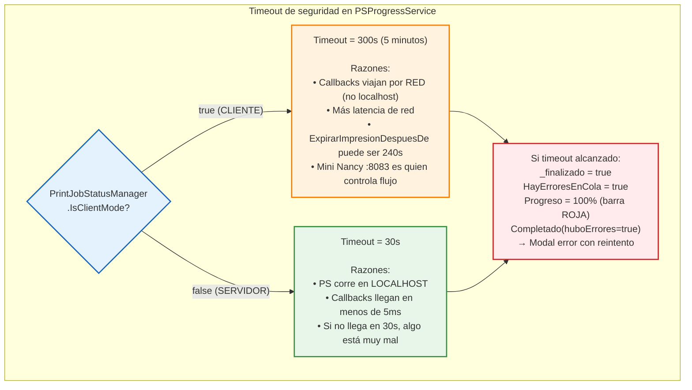

---

## 8. Tabla Resumen — Decisiones por Escenario

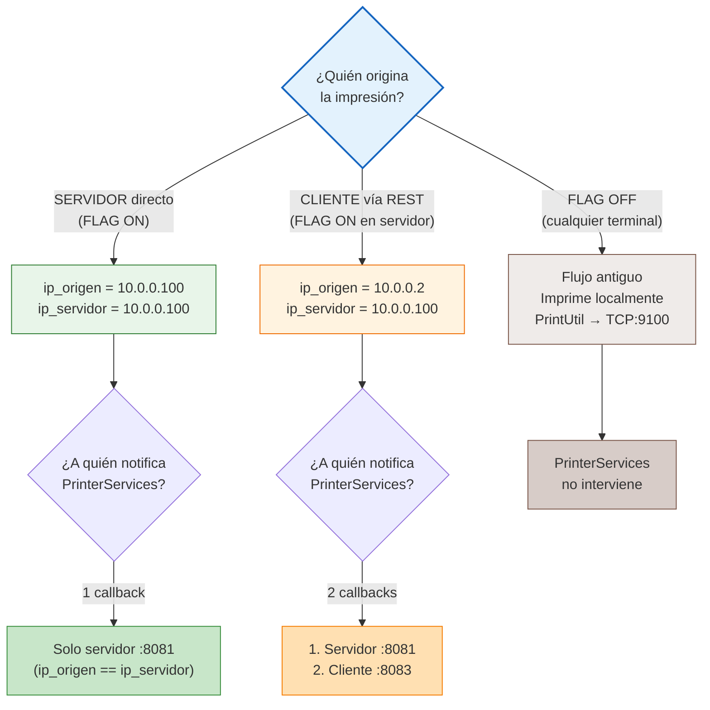
